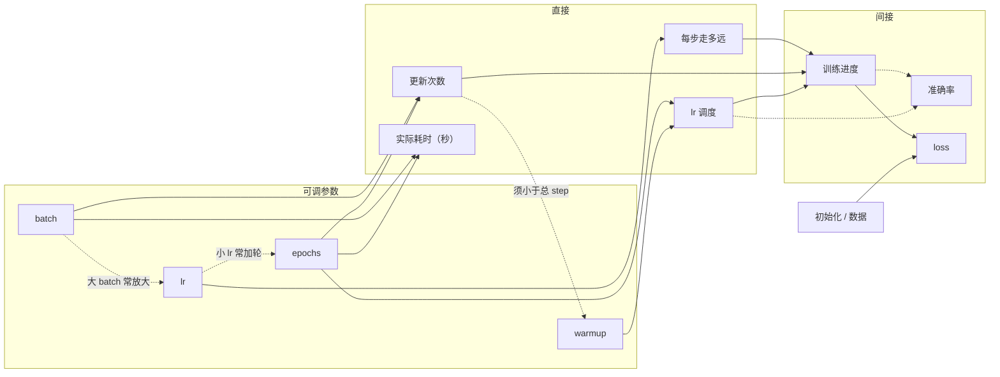

# BERT 文本分类--方案对比（500 条样本）

数据：`Week01/dataset.csv` 前 500 条，train/test = 400/100，种子固定为 42。  
模型：`bert-base-chinese` 文本分类。每次实验重新加载预训练权重。

冻住不变：`max_length=64`、`weight_decay=0.01`、eval batch=16。  
`warmup_steps > 0` 时 Hugging Face 会忽略 `warmup_ratio`，二者按互斥策略对比。

---

## 1. 方案

对照原点 `healthy_baseline`（不是原始脚本里的 `warmup_steps=500`）。  
`orig_warmup500` 只作为原始示例。其余组相对基线一次只改一个量，最后两组做有理由的组合。

| 组别 | name | 相对基线改动 |
|---|---|---|
| 原始示例 | `orig_warmup500` | `warmup_steps=500`（总 step = 100，升不完温） |
| 基线 | `healthy_baseline` | epochs=4, batch=16, lr=`5e-5`, `warmup_ratio=0.1` |
| A1 lr | `lr_2e-5` / `lr_1e-4` | 只改学习率 |
| A2 batch | `batch_8` / `batch_32` | 只改训练 batch（仍用 `warmup_ratio`，预热比例不变） |
| A3 ratio | `warmup_ratio_0` / `warmup_ratio_0.2` | `warmup_steps=0` |
| A4 steps | `warmup_steps_10` | `warmup_ratio=0`；steps=0 与 ratio=0 相同 |
| A5 epoch | `epochs_2` / `epochs_6` | 只改轮数 |
| B 组合 | `combo_small_lr_more_epochs` | lr=`2e-5` + epochs=6 |
| B 组合 | `combo_big_batch_scaled_lr` | batch=32 + lr=`1e-4`（线性缩放） |

共 13 组。测试集约 100 条，准确率差 0.01 等于 1 条样本，单次种子下 0.94～0.96 不宜排绝对名次，应结合 `eval_loss` / `train_loss` 看趋势。

---

## 2. 结果

按 `eval_accuracy` 降序（与 `comparison.csv` 一致）：

| name | epochs | batch | lr | warmup | used / total | train_loss | eval_loss | acc | 秒 |
|---|---:|---:|---:|---|---|---:|---:|---:|---:|
| healthy_baseline | 4 | 16 | 5e-5 | ratio 0.1 | 10 / 100 | 0.7511 | 0.3479 | **0.96** | 36.4 |
| batch_8 | 4 | 8 | 5e-5 | ratio 0.1 | 20 / 200 | 0.6217 | 0.2336 | **0.96** | 50.3 |
| batch_32 | 4 | 32 | 5e-5 | ratio 0.1 | 5 / 52 | 1.0989 | 0.3687 | **0.96** | 30.0 |
| warmup_ratio_0.2 | 4 | 16 | 5e-5 | ratio 0.2 | 20 / 100 | 0.8237 | 0.2132 | **0.96** | 36.2 |
| combo_small_lr_more_epochs | 6 | 16 | 2e-5 | ratio 0.1 | 15 / 150 | 0.8462 | 0.2668 | **0.96** | 53.6 |
| combo_big_batch_scaled_lr | 4 | 32 | 1e-4 | ratio 0.1 | 5 / 52 | 0.7849 | 0.2253 | **0.96** | 29.1 |
| lr_2e-5 | 4 | 16 | 2e-5 | ratio 0.1 | 10 / 100 | 1.2221 | 0.5030 | 0.95 | 37.3 |
| lr_1e-4 | 4 | 16 | 1e-4 | ratio 0.1 | 10 / 100 | 0.5829 | 0.2760 | 0.95 | 36.0 |
| warmup_ratio_0 | 4 | 16 | 5e-5 | 无预热 | 0 / 100 | 0.6664 | 0.2516 | 0.95 | 37.6 |
| warmup_steps_10 | 4 | 16 | 5e-5 | steps 10 | 10 / 100 | 0.7640 | 0.3813 | 0.95 | 36.1 |
| epochs_6 | 6 | 16 | 5e-5 | ratio 0.1 | 15 / 150 | 0.5137 | 0.2071 | 0.94 | 53.7 |
| epochs_2 | 2 | 16 | 5e-5 | ratio 0.1 | 5 / 50 | 1.3638 | 0.6068 | 0.92 | 18.6 |
| orig_warmup500 | 4 | 16 | 5e-5 | steps 500 | **500 / 100** | 2.1335 | 1.2564 | **0.82** | 37.4 |

`orig_warmup500` 的 `warmup_gt_total=True`：预热步数大于总更新次数，学习率全程升温，到不了设定的 `5e-5`。

---

## 3. 分项对比

实线是**直接**改到的量，虚线是**间接**影响或参数之间的搭配。准确率几乎都是间接结果；loss 还被初始化、数据划分一起拉，不能单算在某一个超参头上。

### 预热

原始 `warmup_steps=500` 在约 100 步的任务上是不起作用的：acc 掉到 0.82，`eval_loss` 1.26，明显没训起来。

修好之后，无预热 / ratio 0.1 / ratio 0.2 / 等价的 `warmup_steps=10` 都在 0.95～0.96。小数据上 **用 `warmup_ratio`（例如 0.1）比写死很大的 `warmup_steps` 更稳妥**。

### 学习率

`2e-5` / `5e-5` / `1e-4` 都在常用微调范围，acc 0.95～0.96，分不出谁更好。学习率不直接改分类对错，只改每一步走多远，所以对准确率是**间接**影响的：固定轮数时，走太慢可能还没到位。

只改 lr 时实际耗时几乎一样（36～37s），计算量没变。数据里能看出的是**同样时间内的训练进度**：`2e-5` 更慢，要加到 6 轮（组合 1，54s）acc 才到 0.96；`1e-4` 同样 4 轮走得更远，acc 也没有再涨。

### batch size

8 / 16 / 32 准确率都是 0.96。差别在更新次数和 loss：

- batch=8：更新 200 次，train/eval loss 更低，但更慢（50s）
- batch=32：只更新 52 次，train_loss 升到 1.10
- batch=32 且 lr 提到 `1e-4`：train_loss 回到 0.78，`eval_loss` 0.23，时间最短（29s）

在不影响准确率的情况下，大 batch 少步数时，**把 lr 按 batch 比例放大**可以提高训练效率。

### epoch

epoch 直接改的是更新次数、耗时，以及线性衰减被拉到多长。

---

## 4. 结论

1. **warmup 最好不超过总 step。** 原始脚本 `warmup_steps=500` 是这张表里唯一明显失败的配置（0.82）。小数据应改用 `warmup_ratio≈0.1`，或按 `total_steps` 自己算一个很小的 `warmup_steps`。
2. **修好预热之后，lr / batch / 温和预热比例都在天花板附近（0.95～0.96）。** 默认用基线即可：`lr=5e-5`、`batch=16`、`epochs=4`、`warmup_ratio=0.1`。
3. **改 epoch 等于改调度，不是在同一条曲线上多走几步。** 2 轮把 lr 提前降到接近 0，acc 停在 0.92；基线同样在第 2 轮就到 0.96。6 轮把衰减拉长，best 只到 0.94（第 3 轮），后面没有更高。小 lr 加轮见组合 1，两件事一起变，不能当成「只加 epoch」或「只改 lr」。
4. **大 batch 可以尝试同时放大 lr。** 只加大 batch 会减少更新次数；线性缩放到 `1e-4` 后 loss 可能更好，耗时也变短。
5. 本实验样本少、只跑一个种子，**0.01 的准确率差不要当稳定排名**；看有没有训起来，优先看 `warmup_used` vs `total_steps`，以及 `eval_loss`。
