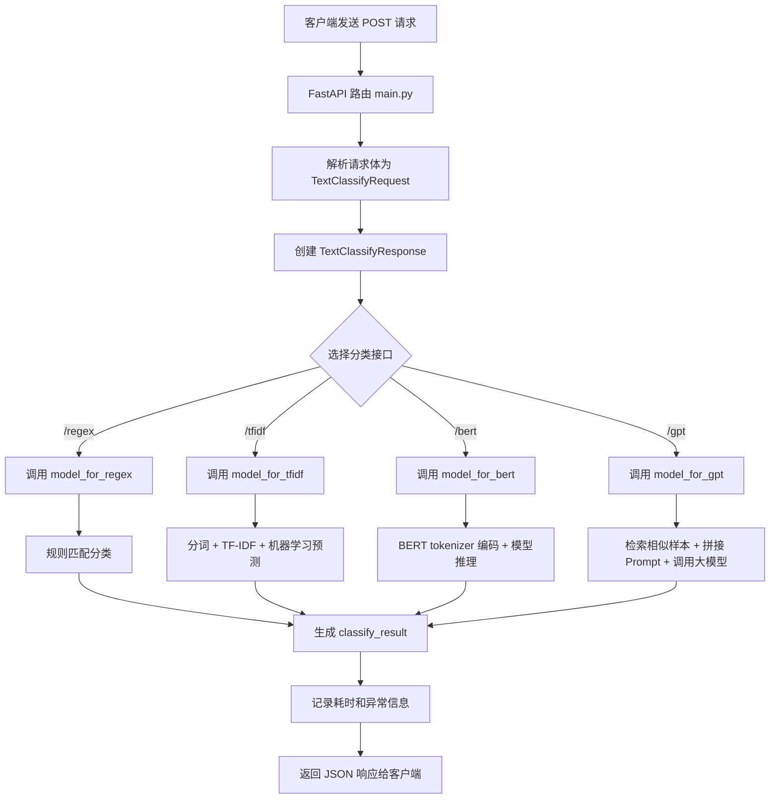

阅读意图识别 01-intent-classify 代码，梳理源文件的作用，绘制从fastapi 接受请求到
     到返回结果的流程，绘制流程图（手绘、自然语言表达）。

# 01-intent-classify 项目源码梳理

## 1. 项目整体定位

这个项目是一个“文本意图识别”服务，提供多个分类后端：

- 正则规则分类：适合简单规则场景
- TF-IDF 分类：传统机器学习方式
- BERT 分类：深度学习方式
- GPT 分类：大模型推理方式

通过 FastAPI 暴露 HTTP 接口，接收用户文本，返回分类结果。

---

## 2. 各个源文件作用

### 1) main.py
作用：FastAPI 的主入口，定义了 4 个接口：

- /v1/text-cls/regex
- /v1/text-cls/tfidf
- /v1/text-cls/bert
- /v1/text-cls/gpt

每个接口都会：
1. 接收请求体
2. 创建响应对象
3. 调用对应模型函数
4. 记录耗时
5. 返回 JSON 响应

### 2) fastapi_demp.py
作用：FastAPI 的最小入门示例。

它演示了：
- 根路径接口
- 带参数的接口

这个文件不是当前项目真正的意图识别主服务入口。

### 3) data_schema.py
作用：定义请求和响应的数据格式。

- TextClassifyRequest：请求体格式
  - request_id
  - request_text
- TextClassifyResponse：返回体格式
  - request_id
  - request_text
  - classify_result
  - classify_time
  - error_msg

### 4) config.py
作用：项目配置文件，存放常量。

主要包括：
- 正则规则词典
- 分类类别名
- TF-IDF 模型路径
- BERT 模型路径
- 大模型接口地址、API Key、模型名称

### 5) model/regex_rule.py
作用：基于规则的分类器。

逻辑是：
- 预先定义关键词规则
- 检查用户文本中是否包含这些关键词
- 若命中，则归入对应类别
- 否则返回 Other

### 6) model/tfidf_ml.py
作用：基于 TF-IDF + 传统机器学习模型的分类器。

逻辑是：
- 对文本进行 jieba 分词
- 去掉停用词
- 用训练好的 TF-IDF 向量和模型做预测

### 7) model/bert.py
作用：基于 BERT 的分类器。

逻辑是：
- 使用 tokenizer 对文本进行编码
- 构造 DataLoader
- 调用 BERT 模型进行推理
- 输出类别编号，再映射为类别名称

### 8) model/prompt.py
作用：基于大模型 GPT 的分类器。

逻辑是：
- 先用 TF-IDF 找到训练集中最相似的样本
- 将这些样本作为 few-shot 示例拼接到提示词中
- 调用 OpenAI 兼容接口完成分类

### 9) logger.py
作用：封装日志模块。

默认会：
- 输出到控制台
- 输出到文件 app.log

### 10) training_code/
作用：训练脚本目录。

- train_tfidf.py：训练 TF-IDF 模型
- train_bert.py：训练 BERT 模型

---

## 3. 从 FastAPI 接受请求到返回结果的流程

### 3.1 请求进入服务
客户端向服务发送一个 POST 请求，例如：

- /v1/text-cls/regex
- /v1/text-cls/tfidf
- /v1/text-cls/bert
- /v1/text-cls/gpt

请求体示例：

```json
{
  "request_id": "abc123",
  "request_text": "帮我播放周杰伦的歌曲"
}
```

### 3.2 FastAPI 解析请求
FastAPI 会根据 data_schema.py 中的 TextClassifyRequest 结构，自动把 JSON 解析为 Python 对象。

也就是说：
- JSON -> Pydantic 模型
- 之后代码中就能直接用 req.request_id、req.request_text

### 3.3 路由函数处理请求
在 main.py 中，对应接口函数会被调用，例如：

- regex_classify(req)
- tfidf_classify(req)
- bert_classify(req)
- gpt_classify(req)

每个函数会先创建一个 TextClassifyResponse 对象，初始化：
- request_id
- request_text
- classify_result
- classify_time
- error_msg

### 3.4 调用具体模型
随后根据接口选择不同的模型函数：

- regex -> model_for_regex(req.request_text)
- tfidf -> model_for_tfidf(req.request_text)
- bert -> model_for_bert(req.request_text)
- gpt -> model_for_gpt(req.request_text)

### 3.5 模型返回结果
不同模型的处理方式不同：

- 正则规则：直接匹配关键词
- TF-IDF：分词、向量化、机器学习预测
- BERT：tokenizer 编码、模型推理
- GPT：找相似样本、拼接 prompt、调用大模型

### 3.6 封装响应并返回
最后将模型输出写回 response.classify_result，并设置：
- error_msg = "ok"
- classify_time = 处理耗时

之后将 response 对象返回，FastAPI 自动序列化成 JSON，发送给客户端。

---

## 4. 流程图（Mermaid）



### 4.1 文本版流程说明

客户端发送 POST 请求 -> FastAPI 路由接收 -> 解析请求体 -> 创建响应对象 -> 根据接口选择对应模型 -> 模型完成分类 -> 写回分类结果 -> 返回 JSON 响应。

---

## 5. 更细的“单条请求”自然语言描述

1. 客户端提交一段文本和一个请求 ID 给接口。
2. FastAPI 接收到请求后，先根据 Pydantic 模型校验数据格式。
3. 路由函数在 main.py 中被触发。
4. 代码会生成一个空的响应对象，用来存放分类结果。
5. 根据接口路径，调用对应的分类模型。
6. 分类模型对文本进行处理，生成一个类别结果。
7. 结果被写回响应对象，并附带耗时和错误信息。
8. FastAPI 将响应对象转换为 JSON 返回给前端或调用方。

---

## 6. 结论

这个项目的核心是：

- FastAPI 负责“接收请求、返回结果”
- 各模型模块负责“真正的分类逻辑”
- data_schema.py 负责“数据结构约束”
- config.py 提供“模型和接口配置”

所以可以把它理解为一个“HTTP 服务层 + 多种分类模型层”的典型结构。
