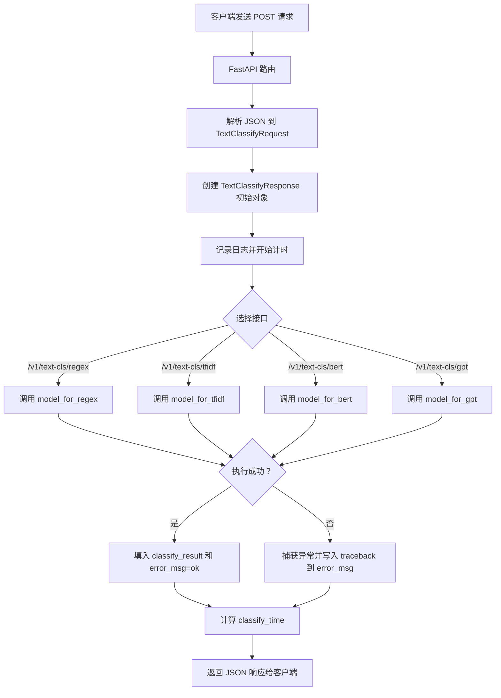

# 作业一

1. langchain 工具调用 和 llm function call 有什么区别？

LangChain 是一个应用开发框架，它对工具注册、工具调用、Agent、Memory、Prompt、工作流等进行了统一封装，可以方便地构建复杂的 AI 应用。

LLM Function Calling 是大模型原生提供的工具调用能力，它负责根据用户输入判断是否需要调用工具，并按照预定义的 JSON Schema 返回工具名称和参数。开发者负责真正执行工具，并将执行结果再返回给模型。

两者不是替代关系，而是不同层次。Function Calling 属于底层模型能力，而 LangChain 属于上层框架。在实际开发中，LangChain 可以利用 OpenAI、Claude 等模型提供的 Function Calling 实现工具调用，但也支持 ReAct 等其他 Agent 实现方式，并不完全依赖 Function Calling。

2. langchain 工具调用 的 速度是受到什么影响？

大模型推理速度、工具执行本身需要的时间、Agent执行轮数、网络延迟、上下文长度

# 作业二

